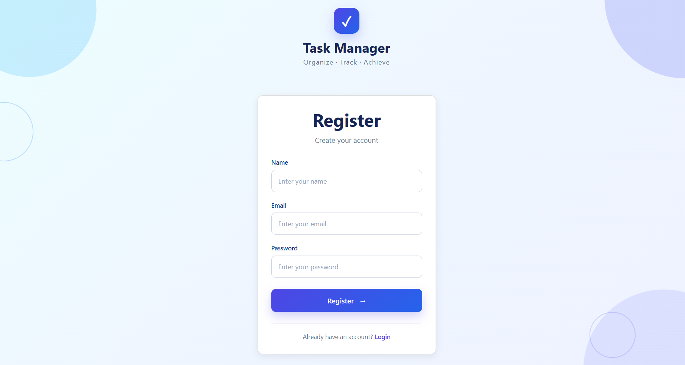
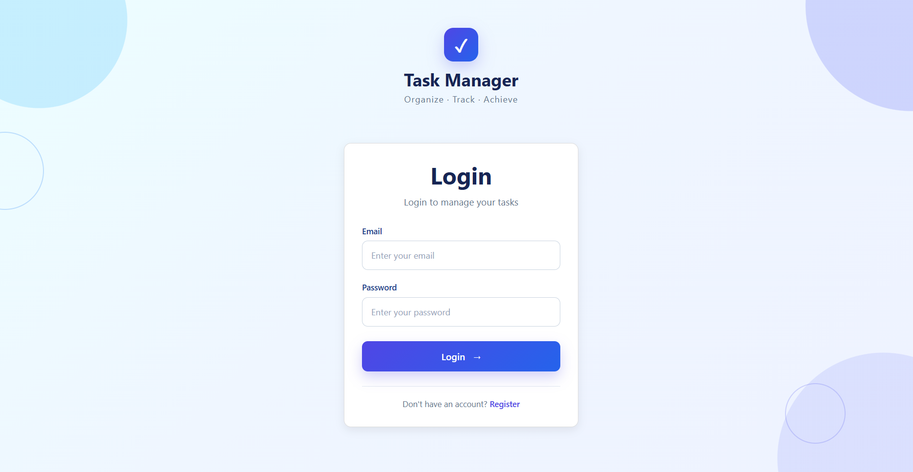
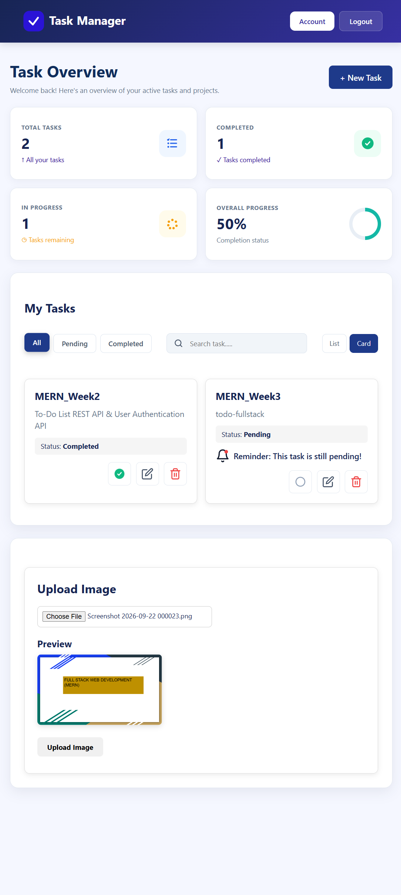

# Week 3 - Task Manager Application

A full-stack Task Manager web application developed as part of my MERN Stack internship Week 3 assignment.

The project connects a React frontend with Express.js, MongoDB, authentication APIs, task management functionality, and an image upload feature.

---

## Project Overview

The Week 3 project focuses on building a complete task management application with:

- User Registration
- User Login
- JWT Authentication
- Task Creation
- Task Viewing
- Task Updating
- Task Deletion
- Task Completion Tracking
- Task Filtering
- Task Searching
- List and Card Views
- Task Statistics
- User Account Information
- Image Upload
- Image Preview
- Uploaded Image Display
- Image Deletion
- Responsive Dashboard UI

---

## Features

### 1. User Authentication

Users can:

- Register a new account
- Login with their account
- Access protected application features
- View their account information
- Logout securely

Authentication uses JWT tokens.

---

### 2. Task Management

Users can manage their own tasks.

Available operations:

- Create a task
- View tasks
- Update tasks
- Delete tasks
- Mark tasks as completed
- View pending tasks

Each task can contain:

- Title
- Description
- Completion status
- Due date

---

### 3. Task Filtering

Tasks can be filtered by:

- All
- Pending
- Completed

---

### 4. Task Search

Users can search for tasks using the task title.

---

### 5. Task Views

The dashboard provides two task display modes:

- List View
- Card View

---

### 6. Task Statistics

The dashboard displays task analytics including:

- Total Tasks
- Completed Tasks
- Tasks In Progress
- Overall Progress

The dashboard also displays a circular progress indicator for overall task completion.

---

### 7. Account Panel

The account section provides:

- Account Details
- User Name
- User Email
- My Tasks
- Uploaded Images
- Logout

The account panel opens from the dashboard header.

---

### 8. Image Upload

The project includes an image upload feature using Multer.

Users can:

- Select an image
- Preview the selected image
- Upload the image
- View uploaded images
- Delete uploaded images

---

## Technologies Used

### Frontend

- React.js
- React Router
- Axios
- Vite
- HTML
- CSS
- JavaScript

### Backend

- Node.js
- Express.js
- MongoDB
- Mongoose
- JWT
- Multer
- CORS

### Development Tools

- Visual Studio Code
- MongoDB Compass
- Postman
- Git
- GitHub

---

## Project Structure

```text
Week_3/
└── todo-fullstack/
    │
    ├── frontend/
    │   ├── src/
    │   │   ├── assets/
    │   │   ├── components/
    │   │   │   ├── TaskForm.jsx
    │   │   │   ├── TaskList.jsx
    │   │   │   └── ImageUpload.jsx
    │   │   │
    │   │   ├── pages/
    │   │   │   ├── Login.jsx
    │   │   │   ├── Register.jsx
    │   │   │   └── Dashboard.jsx
    │   │   │
    │   │   ├── services/
    │   │   │   └── api.js
    │   │   │
    │   │   ├── App.jsx
    │   │   └── App.css
    │   │
    │   ├── package.json
    │   └── vite.config.js
    │
    ├── backend/
    │   ├── uploads/
    │   ├── server.js
    │   └── package.json
    │
    └── README.md

```


## API Services

### Task API

The task API runs on:
http://localhost:3000

Main task endpoint:
/api/tasks

The API supports task creation, retrieval, updating, and deletion.

### Authentication API

The authentication API runs on: 
http://localhost:5000

Authentication endpoints include:
/api/auth/register
/api/auth/login
/api/auth/profile

### Image Upload API

The image upload backend runs on:
 http://localhost:4000

Image upload endpoint: 
POST /api/upload

Get uploaded images:
GET /api/upload

Delete an uploaded image:
DELETE /api/upload/:filename

Uploaded images are served from:
/uploads

---

## Installation

### Clone the Repository
```bash
git clone https://github.com/FalguniRathod-07/Week3_MERN
```

Go to the project directory:
```bash
cd Week3_MERN/todo-fullstack
```

### Frontend Setup

Open a terminal and run:
```bash
cd frontend
```

Install dependencies:
```bash
npm install
```

Start the frontend:
```bash
npm run dev
```

The frontend will normally run at:
http://localhost:5173

### Backend Setup

Open another terminal:
```bash
cd backend
```

Install dependencies:
```bash
npm install
```

Start the image upload backend:
```bash
node server.js
```

The image upload backend runs on:
http://localhost:4000

### Authentication and Task APIs

The project uses the Week 2 authentication and task APIs.

Authentication API
```bash
cd Week_2/User_Authentication_API
npm install
npm start
```

Runs on:
http://localhost:5000

### Task API
```bash
cd Week_2/todo-list-rest-api
npm install
npm start
```

Runs on:
http://localhost:3000

---

## Testing

The APIs were tested using:
Postman
MongoDB Compass
Browser

The frontend was tested using:
Chrome
Vite development server

---

## Screenshots

### Register Page


### Login Page


### Dashboard


### Add New Task


---

## Future Improvements

Possible future improvements include:

Task due-date reminders
Notifications
Task priority
Task categories
Drag-and-drop task management
Dark mode
Cloud image storage
Advanced dashboard analytics

---

## Author

Falguni Rathod
MERN Stack Internship - Week 3

